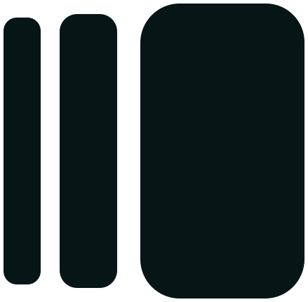

<div align="center">
  
  <h1>Manue Desk</h1>
  <p><strong>A modern, high-performance .desktop file creator and shortcut manager for Linux</strong></p>

[](LICENSE)
[](https://www.rust-lang.org/)
[](https://slint.dev/)
[](https://www.freedesktop.org/)
[](#license)
</div>

> **Manue Desk** is a modern, high-performance desktop entry (`.desktop`) manager and launcher creator for Linux desktop environments (GNOME, KDE Plasma, XFCE, Cinnamon, and more). Built with **Rust** and **Slint UI**, it provides a fluid, dark-mode native interface to seamlessly create, edit, search, and manage your Linux application shortcuts.

---

## Key Features

- ** Quick Launcher Creation**: Easily create `.desktop` entries with custom app names, executable paths, icon paths, and terminal launch flags.
- ** File & Image Pickers**: Integrated native file system browser dialogs (`rfd`) for selecting executable files and icons.
- ** Shortcut Manager**: Search, filter, edit, and delete existing desktop entries saved in `~/.local/share/applications/`.
- ** Real-time Execution Validation**: Option to validate executable path existence prior to saving.
- ** Configurable Settings**: Auto-clear input forms, toggle execution path validation, and configure output directory preferences.
- ** Developer & License Info**: Embedded interactive Info page displaying developer contact info, GitHub links, and open-source license details.
- ** Frameless Custom Window Controls**: Dark-teal futuristic UI with custom minimize and close window buttons.

---

## Screenshots & UI Design

- **Tab 1: Create Launcher** — Configure application details with instant creation.
- **Tab 2: Manage Shortcuts** — Search and perform CRUD operations on your installed `.desktop` files.
- **Tab 3: Settings** — Customize application preferences and toggle validation flags.
- **Tab 4: Developer & App Info** — Squarish developer avatar profile card, links, website, and Apache 2.0 license notice.

---

## Prerequisites & Installation

### 1. Requirements
- Linux OS (Fedora, Ubuntu, Arch Linux, Debian, etc.)
- Rust & Cargo toolchain (Rust 2021 edition or newer)

### 2. Install Rust (if not already installed)
```bash
curl --proto '=https' --tlsv1.2 -sSf https://sh.rustup.rs | sh
source "$HOME/.cargo/env"
```

### 3. Build & Run from Source

```bash
# Clone the repository
git clone https://github.com/syed-sameer-ul-hassan/ADD-TO-MANUE.git
cd ADD-TO-MANUE

# Build and run in development mode
cargo run

# Build optimized release binary
cargo build --release
```

The compiled binary will be located at:
`./target/release/manue-desk`

---

## Project Structure

```text
ADD-TO-MANUE/
├── Cargo.toml          # Rust crate manifest & dependencies
├── build.rs            # Build script compiling Slint UI declarations
├── LICENSE             # Apache License 2.0
├── README.md           # Project documentation
├── src/
│   └── main.rs         # Main application logic & Slint Rust bindings
└── ui/
    ├── main.slint      # Slint declarative UI components & state layout
    └── assets/         # Embedded vector icons & developer avatar image
```

---

## Developer Information

- **Developer**: Syed Sameer Ul Hassan
- **GitHub Profile**: [@syed-sameer-ul-hassan](https://github.com/syed-sameer-ul-hassan)
- **Official Website**: [manuedesk.orildo.sbs](https://manudesk.orildo.sbs)
- **Developer Portfolio**: [sameer.orildo.sbs](https://sameer.orildo.sbs)
- **Email Contact**: [manudesk@orildo.sbs](mailto:manudesk@orildo.sbs)
- **GitHub Repository**: [syed-sameer-ul-hassan/Manue-Desk](https://github.com/syed-sameer-ul-hassan/Manue-Desk)

---

## License

This project is open-source software licensed under the **[Apache License 2.0](LICENSE)**.

```text
Copyright 2026 Syed Sameer Ul Hassan

Licensed under the Apache License, Version 2.0 (the "License");
you may not use this file except in compliance with the License.
You may obtain a copy of the License at

    http://www.apache.org/licenses/LICENSE-2.0

Unless required by applicable law or agreed to in writing, software
distributed under the License is distributed on an "AS IS" BASIS,
WITHOUT WARRANTIES OR CONDITIONS OF ANY KIND, either express or implied.
See the License for the specific language governing permissions and
limitations under the License.
```
